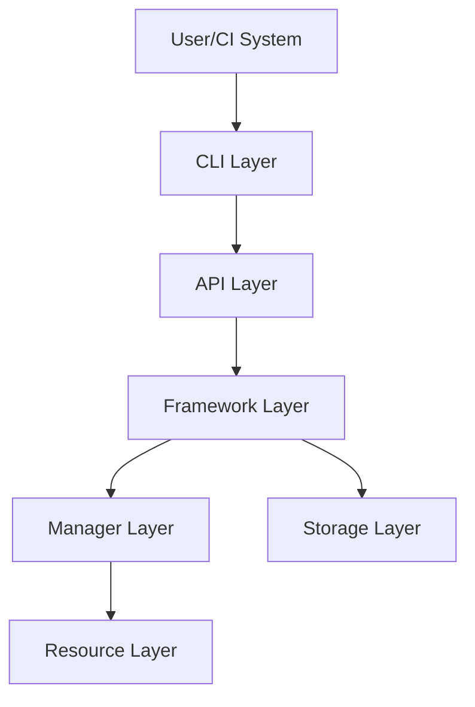
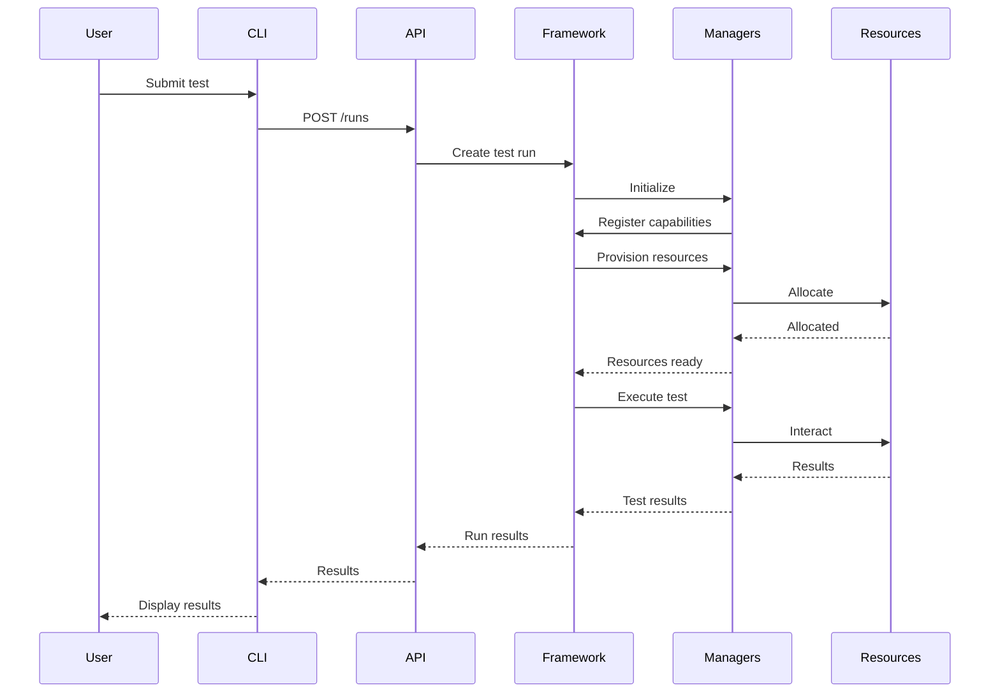
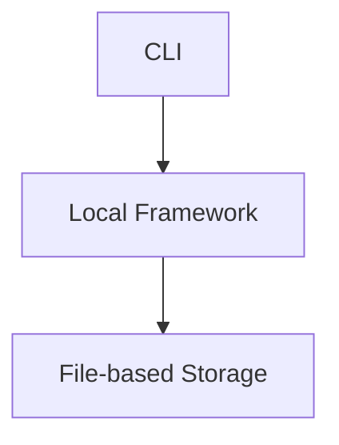
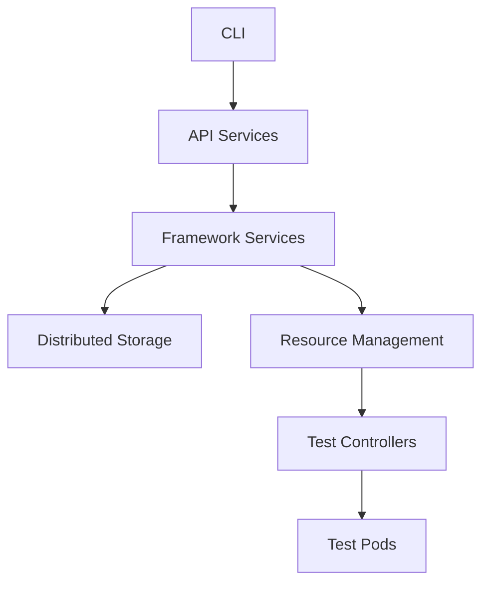

# Galasa Architecture Documentation

This document serves as an index to the architectural documentation for the Galasa framework.

## Overview

Galasa is an open-source test automation framework designed for enterprise-scale testing. It provides a rich ecosystem of components that enable automated testing across various platforms and technologies, including mainframe systems, cloud environments, and more.

## Documentation Index

1. [Architecture Overview](architecture-overview.md) - High-level overview of the Galasa architecture
2. [Manager Architecture](manager-architecture.md) - Detailed explanation of the manager architecture
3. [Test Execution Lifecycle](test-execution-lifecycle.md) - How tests are executed in Galasa
4. [Design Patterns](design-patterns.md) - Key design patterns used in the Galasa codebase
5. [Storage Services](storage-services.md) - Explanation of Galasa's storage services
6. [CLI Architecture](cli-architecture.md) - Architecture of the Galasa command-line interface

## Key Architectural Principles

Galasa's architecture is built on several key principles:

1. **Modularity**: Components are designed to be modular and replaceable
2. **Extensibility**: The framework is designed to be extended with new capabilities
3. **Separation of Concerns**: Clear separation between different aspects of the system
4. **Pluggability**: Components can be plugged in and out as needed
5. **Testability**: The architecture facilitates testing of components

## Architectural Layers

### CLI Layer
The CLI layer provides command-line access to Galasa functionality. It's designed for both interactive use and integration with CI/CD pipelines.

### API Layer
The API layer provides programmatic access to Galasa services through REST APIs. It enables integration with other systems and tools.

### Framework Layer
The Framework layer is the core of Galasa. It manages test execution, resource allocation, and provides services to managers and tests.

### Manager Layer
The Manager layer consists of pluggable components that provide specific functionality for different technologies and platforms.

### Resource Layer
The Resource layer represents the actual resources that tests interact with, such as mainframes, databases, and cloud services.

### Storage Layer
The Storage layer provides services for storing configuration, state, and results.

## Component Interactions

## Deployment Architecture

Galasa can be deployed in various configurations:

### Local Development

### Kubernetes Deployment

## Future Architectural Directions

The Galasa architecture continues to evolve in several directions:

1. **Cloud-Native**: Enhanced support for cloud-native deployment and testing
2. **Scalability**: Improvements for handling larger test volumes
3. **Integration**: Better integration with CI/CD pipelines and DevOps tools
4. **Observability**: Enhanced monitoring and observability
5. **Security**: Improved security features and compliance

## Contributing to the Architecture

When contributing to Galasa, consider these architectural guidelines:

1. Follow existing design patterns
2. Maintain separation of concerns
3. Design for testability
4. Document architectural decisions
5. Consider backward compatibility

For more details on contributing, see the [CONTRIBUTING.md](../CONTRIBUTING.md) file.