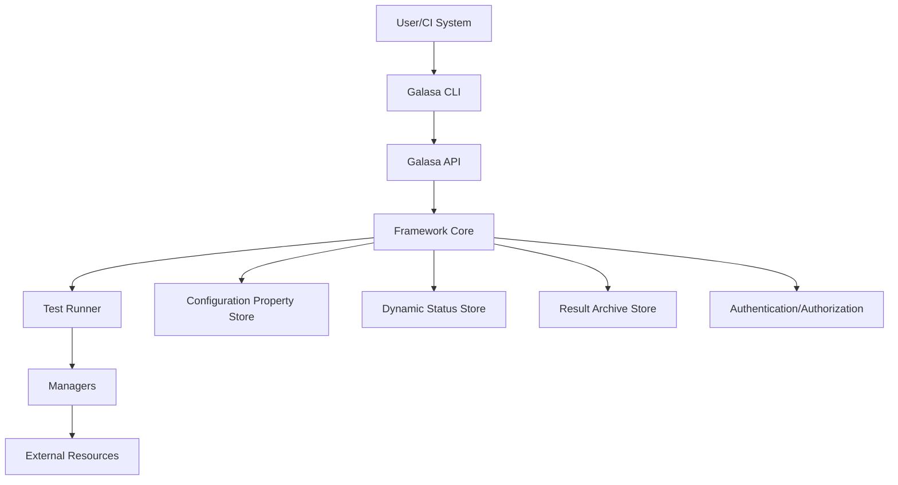

# Galasa Architecture Overview

This document provides a high-level overview of the Galasa architecture, explaining its key components and how they interact.

## Introduction

Galasa is an open-source test automation framework designed for enterprise-scale testing. It provides a rich ecosystem of components that enable automated testing across various platforms and technologies, including mainframe systems, cloud environments, and more.

## Core Architecture Components

The Galasa framework is built with a modular architecture that consists of several key components:

1. **Framework Core**: The central component that manages test execution, resource allocation, and lifecycle management
2. **Managers**: Pluggable components that provide specific functionality for different technologies and platforms
3. **Test Runner**: Responsible for executing tests and managing their lifecycle
4. **Result Archive Store (RAS)**: Stores test results and artifacts
5. **Configuration Property Store (CPS)**: Manages configuration properties for the framework and tests
6. **Dynamic Status Store (DSS)**: Maintains dynamic state information during test execution
7. **CLI**: Command-line interface for interacting with the Galasa ecosystem

## High-Level Architecture Diagram

## Key Components in Detail

### Framework Core

The Framework Core is the central component of Galasa. It provides:

- Test lifecycle management
- Resource allocation and management
- Service integration
- Extension points for managers and other components

The Framework implements the `IFramework` interface and provides access to various services like CPS, DSS, RAS, etc.

### Managers

Managers are pluggable components that provide specific functionality for different technologies and platforms. They follow a plugin architecture and are loaded dynamically at runtime. Managers can:

- Provision and manage resources
- Provide interfaces for test interaction with resources
- Handle cleanup and resource release
- Implement test annotations for easy resource declaration

Managers are organized into categories:
- Core Managers: Essential functionality for all tests
- Platform Managers: Support for specific platforms (zOS, Linux, Windows, etc.)
- Technology Managers: Support for specific technologies (CICS, DB2, JMeter, etc.)
- Cloud Managers: Support for cloud platforms (Kubernetes, Docker, etc.)

### Test Runner

The Test Runner is responsible for:
- Loading and executing tests
- Managing the test lifecycle
- Coordinating with managers for resource provisioning
- Reporting test results

### Storage Services

Galasa uses several storage services:

- **Configuration Property Store (CPS)**: Manages configuration properties
- **Dynamic Status Store (DSS)**: Maintains dynamic state information
- **Result Archive Store (RAS)**: Stores test results and artifacts
- **Credentials Store**: Securely stores and provides access to credentials

### CLI and API

The CLI provides a command-line interface for interacting with Galasa, while the API provides programmatic access to Galasa services.