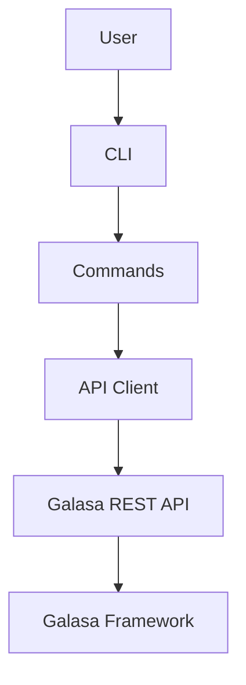
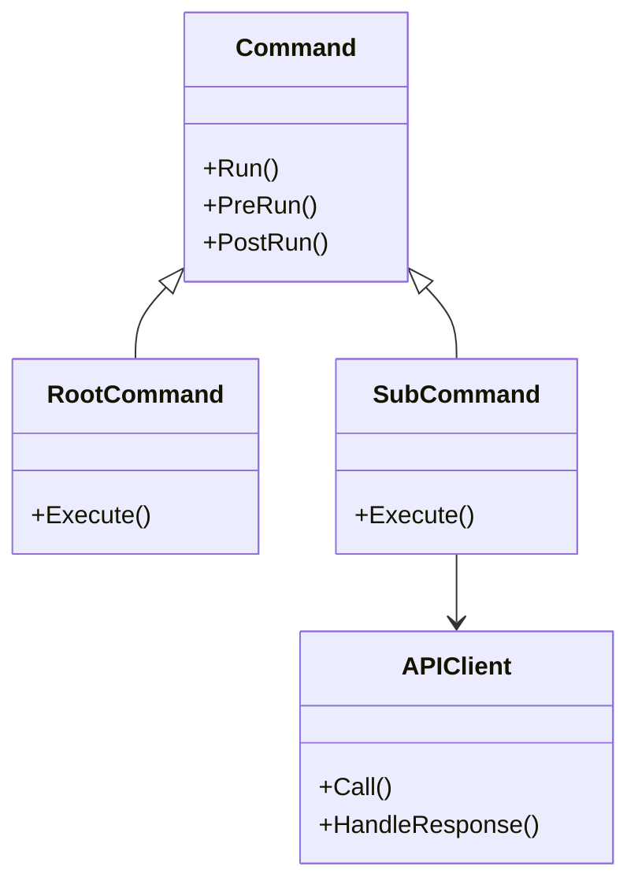
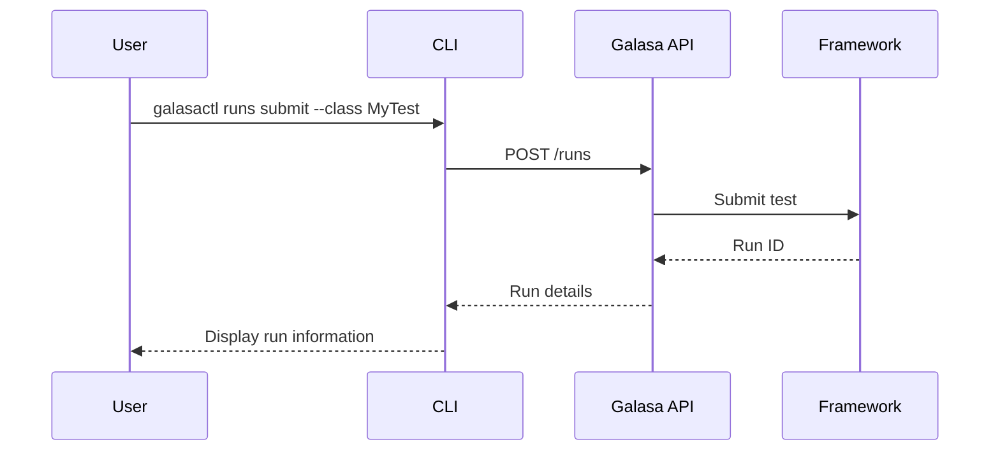
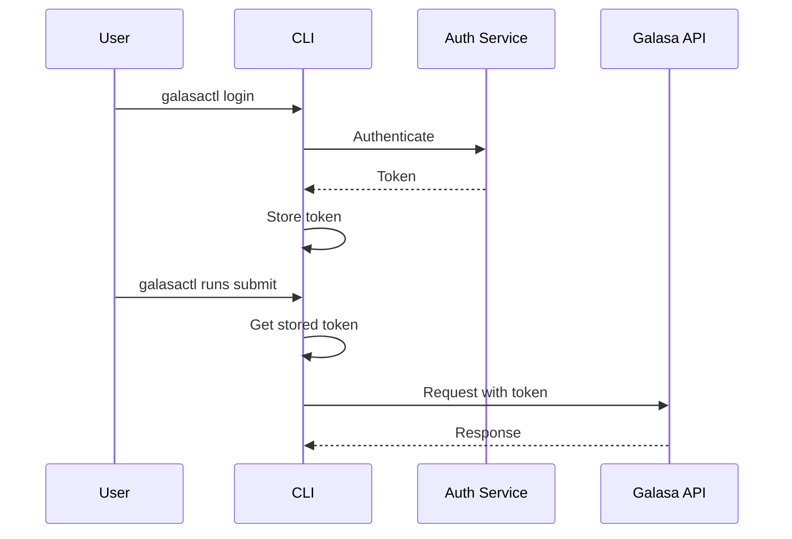
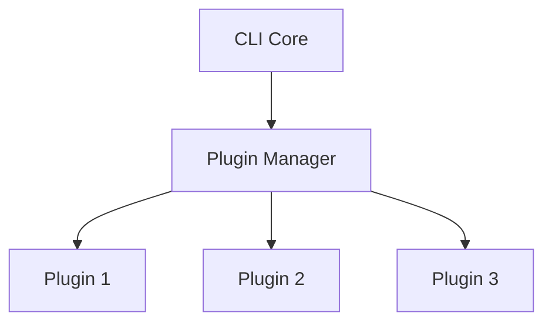

# Galasa CLI Architecture

This document explains the architecture of the Galasa Command Line Interface (CLI), which provides a user-friendly way to interact with the Galasa ecosystem.

## Overview

The Galasa CLI (`galasactl`) is a command-line tool written in Go that allows users to:

1. Run tests
2. Manage the Galasa ecosystem
3. Query test results
4. Work with test artifacts
5. Configure Galasa components

## Architecture



### Key Components

1. **Command Structure**: Hierarchical command organization
2. **API Client**: Go client for the Galasa REST API
3. **Configuration Management**: Handles CLI configuration
4. **Output Formatting**: Formats output for different formats (JSON, YAML, text)

## Command Structure

The CLI uses a hierarchical command structure:

```
galasactl
├── runs
│   ├── submit
│   ├── get
│   └── cancel
├── resources
│   ├── create
│   ├── get
│   └── delete
├── results
│   ├── get
│   └── download
└── ecosystem
    ├── bootstrap
    ├── configure
    └── status
```

## Implementation

The CLI is implemented using:

- **Cobra**: Go library for creating powerful modern CLI applications
- **Go HTTP Client**: For API communication
- **Go Templates**: For output formatting
- **YAML/JSON Libraries**: For configuration and data handling



## API Communication

The CLI communicates with the Galasa ecosystem through REST APIs:



## Authentication

The CLI supports multiple authentication methods:

1. **API Key**: Using an API key for authentication
2. **OAuth**: Using OAuth tokens for authentication
3. **Basic Auth**: Using username/password for authentication

Authentication flow:



## Configuration Management

The CLI manages configuration through:

1. **Global Configuration**: System-wide settings
2. **User Configuration**: User-specific settings
3. **Project Configuration**: Project-specific settings
4. **Environment Variables**: Override settings
5. **Command-line Flags**: Override settings for a single command

Configuration precedence (highest to lowest):
- Command-line flags
- Environment variables
- Project configuration
- User configuration
- Global configuration

## Output Formatting

The CLI supports multiple output formats:

1. **Human-readable**: Default formatted output
2. **JSON**: Structured JSON output
3. **YAML**: Structured YAML output
4. **CSV**: Tabular data for spreadsheets

Example:
```
galasactl runs get --output json
```

## Error Handling

The CLI implements robust error handling:

1. **User Errors**: Clear messages for user mistakes
2. **System Errors**: Detailed information for system issues
3. **Network Errors**: Handling API communication failures
4. **Retry Logic**: For transient failures

## Plugin Architecture

The CLI supports plugins for extensibility:



Plugins can:
1. Add new commands
2. Extend existing commands
3. Add new output formats
4. Integrate with external systems

## Integration with CI/CD

The CLI is designed to integrate with CI/CD pipelines:

1. **Exit Codes**: Standard exit codes for automation
2. **Machine-readable Output**: JSON/YAML for parsing
3. **Non-interactive Mode**: For automated execution
4. **Credentials Management**: Secure handling of credentials

Example Jenkins integration:
```groovy
stage('Run Galasa Tests') {
    steps {
        sh 'galasactl runs submit --class com.example.TestClass --bootstrap http://galasa:8080/bootstrap'
    }
}
```

## Development Workflow

The CLI development follows these principles:

1. **Modular Design**: Separate concerns for maintainability
2. **Test-Driven Development**: Comprehensive test coverage
3. **Continuous Integration**: Automated builds and tests
4. **Versioning**: Semantic versioning for releases
5. **Documentation**: Embedded help and external documentation