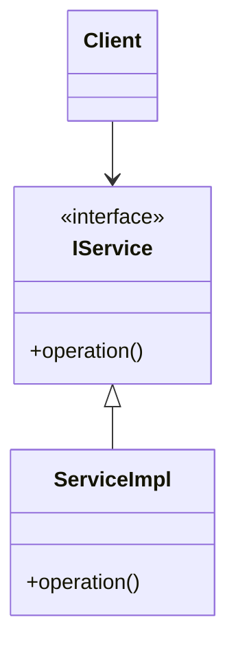
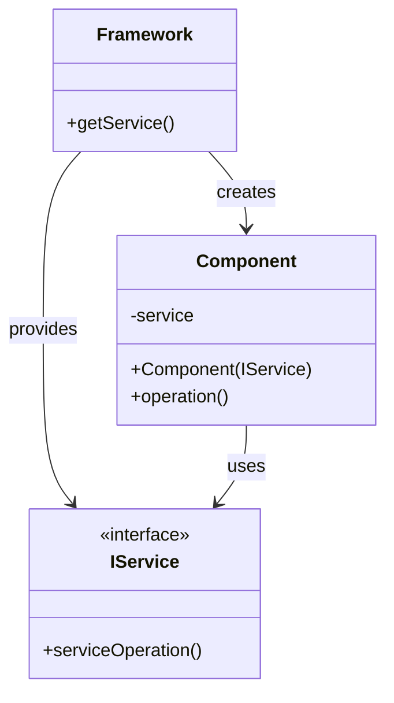
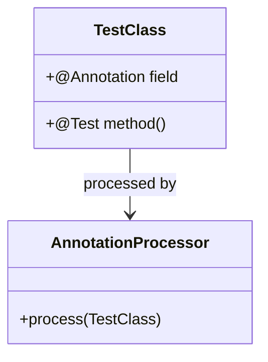
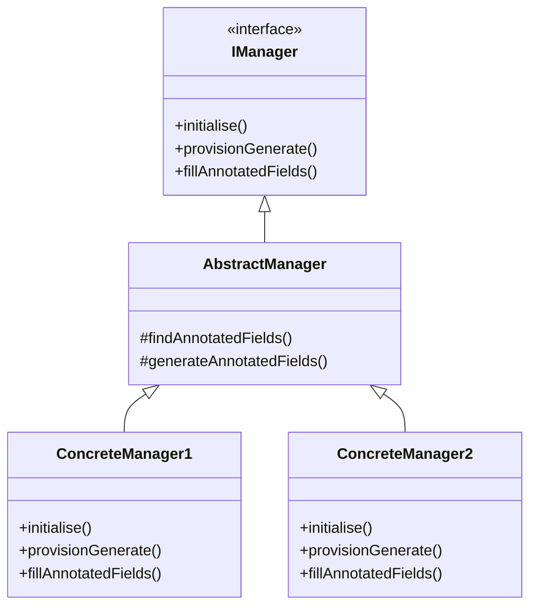
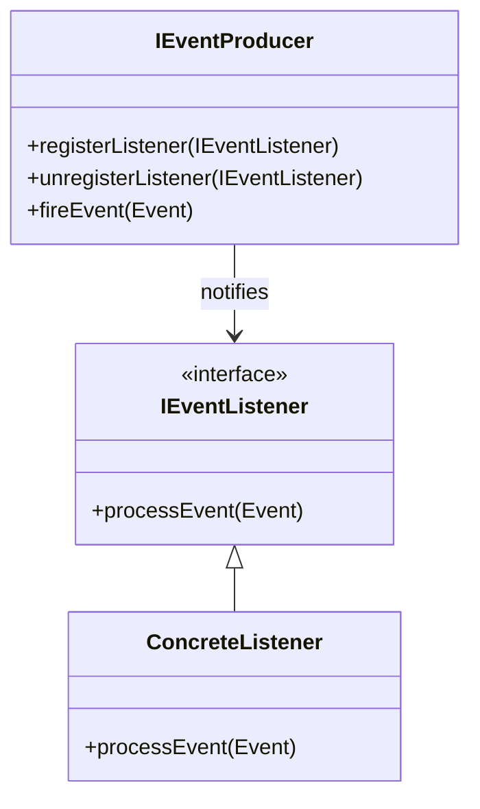
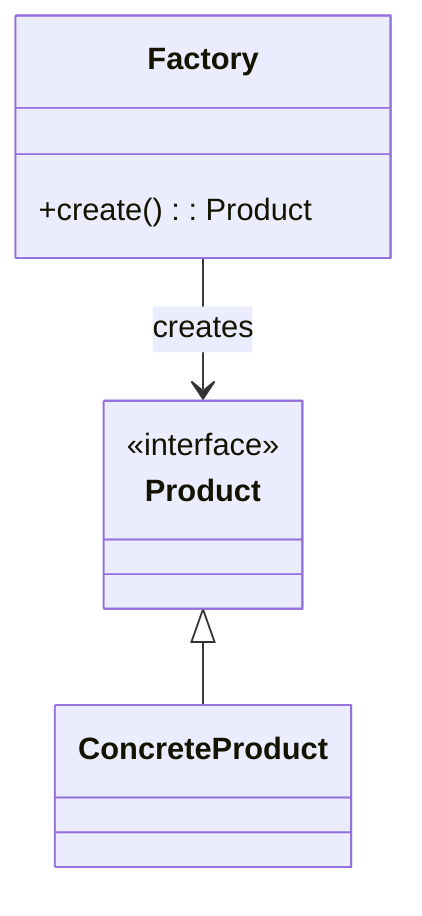
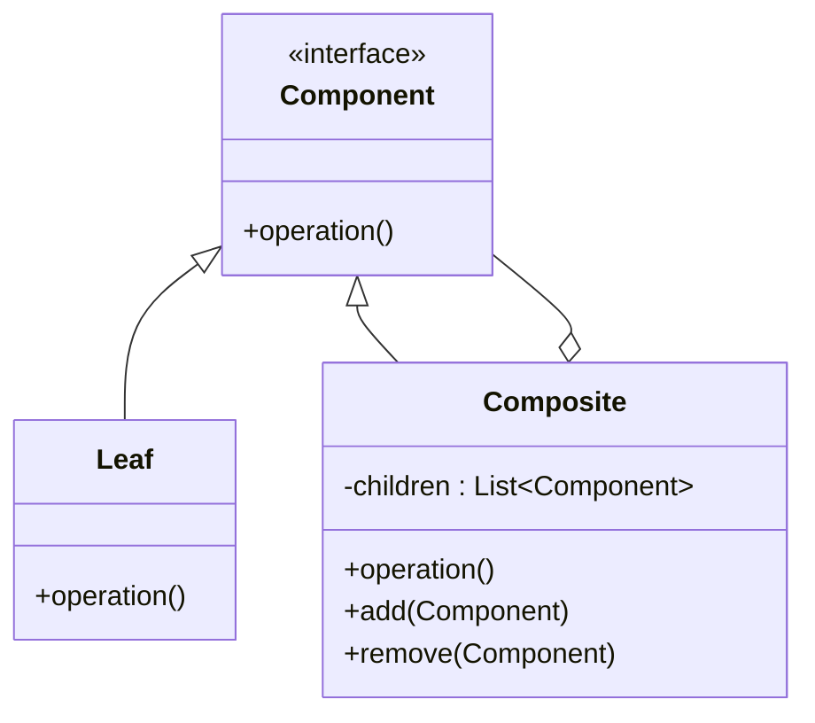
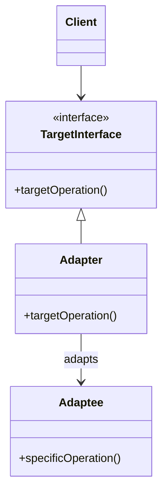
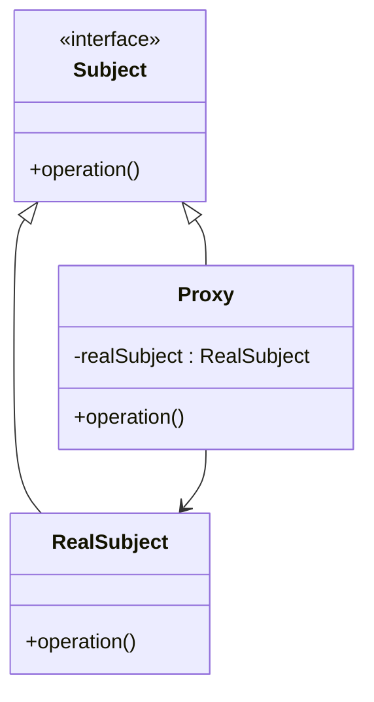

# Design Patterns in Galasa

This document outlines the key design patterns used in the Galasa framework architecture.

## Service Provider Interface (SPI) Pattern

Galasa makes extensive use of the Service Provider Interface pattern, which separates interface definitions from their implementations.

Examples in Galasa:
- `IManager` interface with various manager implementations
- `IResultArchiveStore` interface with different storage implementations
- `IConfigurationPropertyStore` interface with different backend implementations

Benefits:
- Allows for pluggable implementations
- Enables loose coupling between components
- Facilitates testing with mock implementations

## Dependency Injection

Galasa uses dependency injection to provide components with their dependencies.

Examples in Galasa:
- Managers are injected with the Framework instance
- Test classes are injected with manager-provided resources
- Services are injected with their dependencies

Benefits:
- Reduces tight coupling between components
- Makes testing easier through mock dependencies
- Improves code modularity

## Annotation-Based Configuration

Galasa uses Java annotations extensively for configuration and resource declaration.

Examples in Galasa:
- `@ZosImage` for declaring zOS image requirements
- `@HttpClient` for declaring HTTP client requirements
- `@Test` for marking test methods

Benefits:
- Declarative programming style
- Reduced boilerplate code
- Clear separation of configuration from implementation

## Manager Pattern

Galasa's manager architecture is a specialized form of the Strategy pattern, where each manager provides a specific capability.

Benefits:
- Encapsulates specific functionality
- Allows for composition of capabilities
- Enables extensibility

## Observer Pattern

Galasa uses the Observer pattern for event notification.

Examples in Galasa:
- Framework events for test lifecycle notifications
- Resource status change notifications
- Run state change events

Benefits:
- Loose coupling between event producers and consumers
- Support for multiple listeners
- Asynchronous processing

## Factory Pattern

Galasa uses factory patterns to create complex objects.

Examples in Galasa:
- `GalasaFactory` for creating framework instances
- Manager factories for creating resources
- Test runner factories

Benefits:
- Encapsulates object creation logic
- Allows for different creation strategies
- Simplifies client code

## Composite Pattern

Galasa uses the Composite pattern for managing collections of similar objects.

Examples in Galasa:
- Multiple Result Archive Stores
- Manager collections
- Test class hierarchies

Benefits:
- Uniform treatment of individual and composite objects
- Simplified client code
- Hierarchical structures

## Adapter Pattern

Galasa uses adapters to make incompatible interfaces work together.

Examples in Galasa:
- Adapters for different storage backends
- Protocol adapters in communication managers
- Legacy system integration

Benefits:
- Reuse of existing components
- Gradual migration path
- Interface compatibility

## Proxy Pattern

Galasa uses proxies to control access to objects.

Examples in Galasa:
- Security proxies for credential access
- Remote proxies for distributed resources
- Lazy-loading proxies for resource efficiency

Benefits:
- Access control
- Lazy initialization
- Remote resource representation