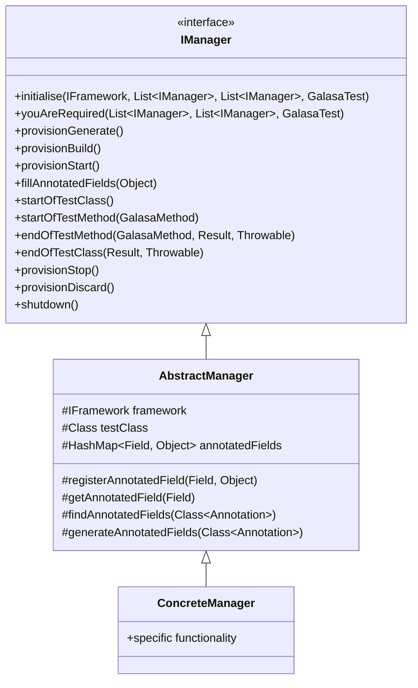

# Galasa Manager Architecture

This document explains the manager architecture in Galasa, which is a key part of the framework's extensibility model.

## What are Managers?

Managers are pluggable components that provide specific functionality for different technologies and platforms. They follow a plugin architecture and are loaded dynamically at runtime. Managers are responsible for:

- Provisioning and managing resources
- Providing interfaces for test interaction with resources
- Handling cleanup and resource release
- Implementing test annotations for easy resource declaration

## Manager Hierarchy



## Manager Lifecycle

Managers follow a specific lifecycle during test execution:

1. **Initialization**: Managers are initialized with the framework and test class
2. **Dependency Resolution**: Managers declare dependencies on other managers
3. **Resource Provisioning**: Managers provision resources in multiple phases:
   - Generate: Initial resource planning
   - Build: Resource creation
   - Start: Resource initialization
4. **Test Execution**: Managers support test execution:
   - Fill annotated fields in test class
   - Support test methods
   - Handle test results
5. **Resource Cleanup**: Managers clean up resources:
   - Stop: Graceful shutdown
   - Discard: Resource deletion

## Manager Annotations

Managers use Java annotations to:

1. Mark fields in test classes for automatic injection
2. Define resource requirements
3. Configure resource properties

Example:
```java
@ZosImage(imageTag="A")
public IZosImage zosImage;

@Cics(cicsTag="CICS1", imageTag="A")
public ICicsRegion cicsRegion;
```

## Manager Dependency Model

Managers can depend on other managers to provide functionality. For example:

- The CICS Manager depends on the zOS Manager for zOS image provisioning
- The zOS3270 Manager depends on the zOS Manager for terminal connections

Dependencies are resolved at runtime through the `youAreRequired()` method.

## Service Provider Interface (SPI)

Managers implement the Service Provider Interface (SPI) pattern:

1. Core interfaces are defined in the framework
2. Managers provide implementations of these interfaces
3. The framework discovers and loads managers at runtime
4. Tests interact with the interfaces, not the implementations

## Resource Management

Managers handle resource management through:

1. **Provisioning**: Allocating resources when needed
2. **Sharing**: Allowing resources to be shared between tests
3. **Cleanup**: Ensuring resources are properly released
4. **Isolation**: Preventing resource conflicts between tests

## Manager Categories

Galasa organizes managers into several categories:

1. **Core Managers**: Essential functionality for all tests
2. **Platform Managers**: Support for specific platforms (zOS, Linux, Windows)
3. **Technology Managers**: Support for specific technologies (CICS, DB2, JMeter)
4. **Cloud Managers**: Support for cloud platforms (Kubernetes, Docker)
5. **Utility Managers**: Provide utility functions (HTTP, Artifact)