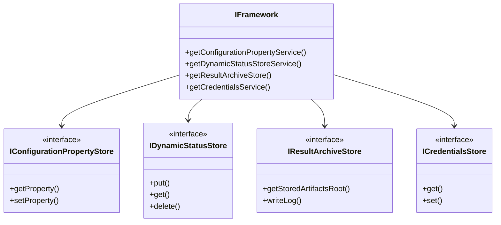
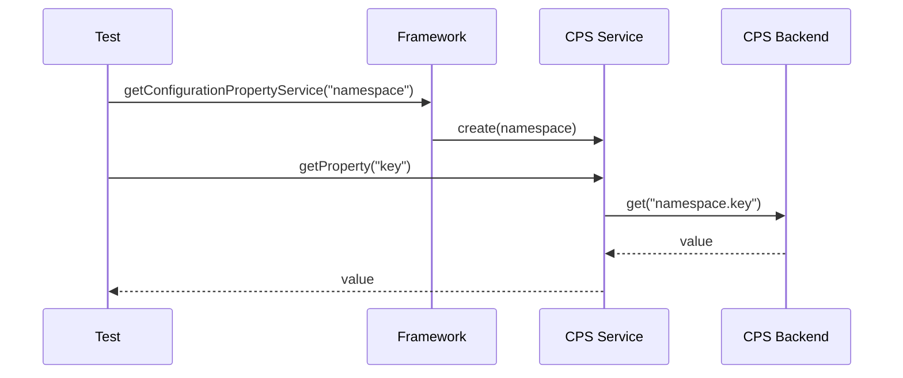
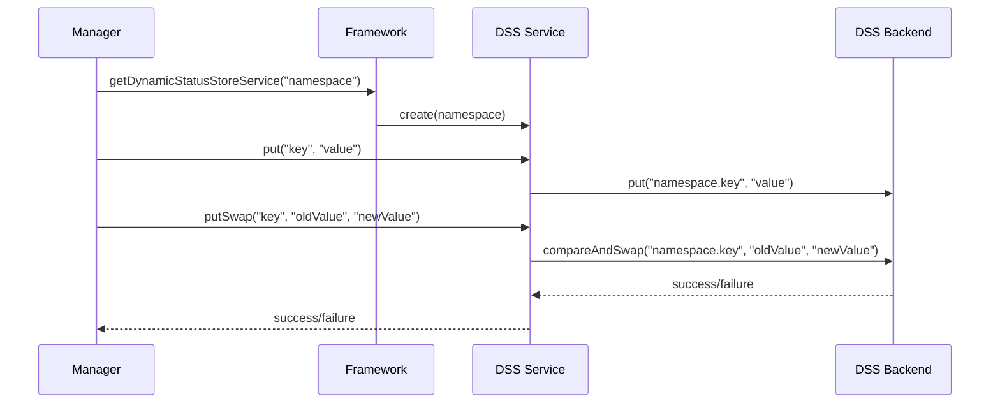
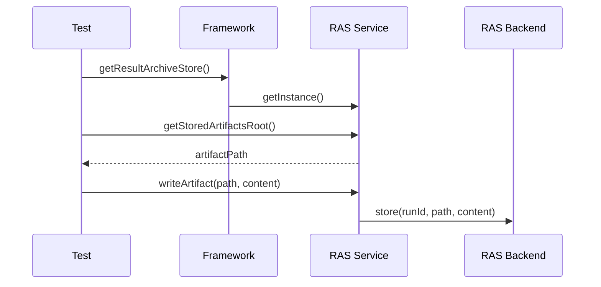
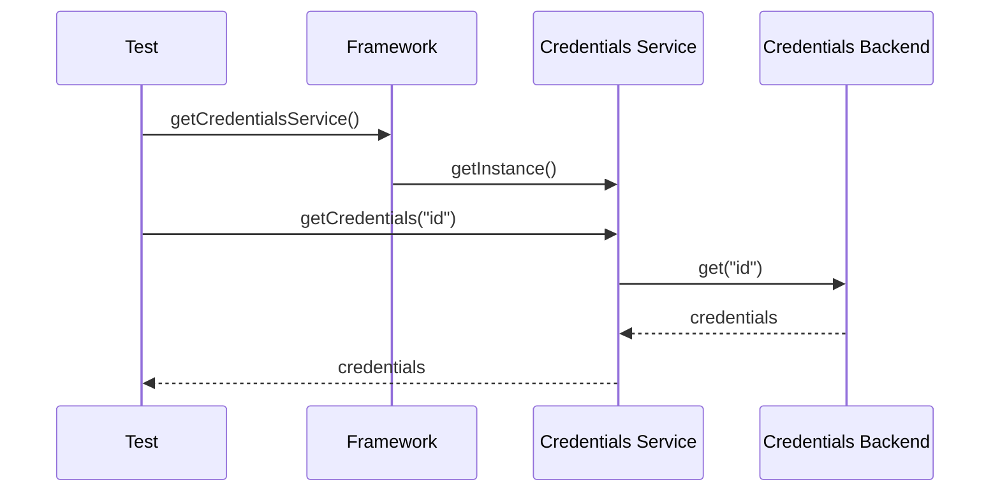

# Galasa Storage Services

This document explains the storage services used in Galasa for configuration, state management, and results storage.

## Overview

Galasa uses several storage services to manage different types of data:

1. **Configuration Property Store (CPS)**: Manages configuration properties
2. **Dynamic Status Store (DSS)**: Maintains dynamic state information
3. **Result Archive Store (RAS)**: Stores test results and artifacts
4. **Credentials Store**: Securely stores and provides access to credentials

These services are designed to be pluggable, allowing different backend implementations.

## Architecture

## Configuration Property Store (CPS)

The Configuration Property Store provides a hierarchical key-value store for configuration properties.

### Key Features

- Namespace-based property organization
- Property inheritance and overrides
- Support for different backend implementations
- Property encryption for sensitive values

### Usage Pattern

### Implementation

The CPS is implemented with:

- `IConfigurationPropertyStore`: Core interface for the backend
- `IConfigurationPropertyStoreService`: Service interface for clients
- `FrameworkConfigurationPropertyService`: Default implementation

## Dynamic Status Store (DSS)

The Dynamic Status Store maintains dynamic state information during test execution.

### Key Features

- Transactional updates
- Namespace isolation
- Atomic operations
- Watch capability for state changes

### Usage Pattern

### Implementation

The DSS is implemented with:

- `IDynamicStatusStore`: Core interface for the backend
- `IDynamicStatusStoreService`: Service interface for clients
- `FrameworkDynamicStatusStoreService`: Default implementation

## Result Archive Store (RAS)

The Result Archive Store captures and stores test results and artifacts.

### Key Features

- Structured storage of test results
- Log capture and storage
- Artifact storage
- Test metadata storage
- Multiple backend support

### Usage Pattern

### Implementation

The RAS is implemented with:

- `IResultArchiveStore`: Core interface for the backend
- `IResultArchiveStoreService`: Service interface for clients
- `FrameworkMultipleResultArchiveStore`: Composite implementation supporting multiple backends

## Credentials Store

The Credentials Store securely manages and provides access to credentials.

### Key Features

- Secure storage of credentials
- Credential access control
- Support for different credential types
- Integration with external credential providers

### Usage Pattern

### Implementation

The Credentials Store is implemented with:

- `ICredentialsStore`: Core interface for the backend
- `ICredentialsService`: Service interface for clients
- `FrameworkCredentialsService`: Default implementation

## Backend Implementations

Galasa supports multiple backend implementations for each storage service:

### CPS Backends

- File-based CPS
- etcd CPS
- Kubernetes ConfigMap CPS

### DSS Backends

- File-based DSS
- etcd DSS
- Redis DSS

### RAS Backends

- File-based RAS
- Object storage RAS (S3, etc.)
- Database RAS

### Credentials Backends

- File-based Credentials Store
- Vault Credentials Store
- Kubernetes Secret Credentials Store

## Integration with Test Execution

The storage services are integrated with the test execution lifecycle:

1. **Before Test**: Load configuration, allocate resources
2. **During Test**: Record logs and artifacts, update dynamic state
3. **After Test**: Store final results, release resources

## Security Considerations

- Encryption of sensitive data
- Access control for credentials
- Secure communication with backends
- Isolation between test runs