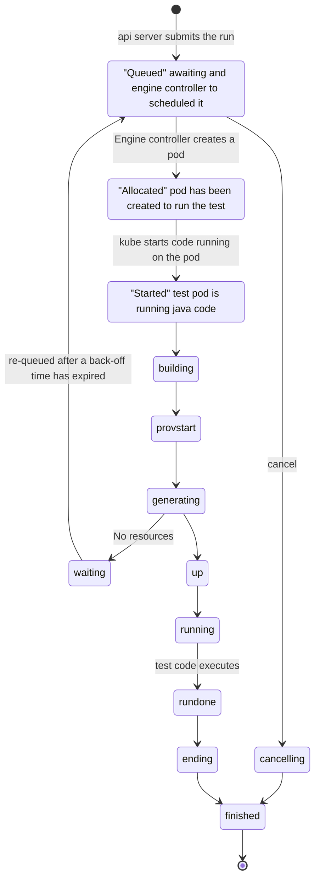
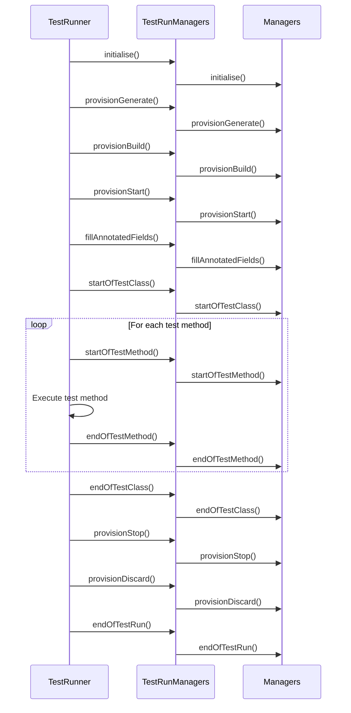

# Galasa Test Execution Lifecycle

This document explains the test execution lifecycle in Galasa, from submission to completion.

## Test Run States

As shown in the existing documentation, a test run goes through multiple states during its lifecycle:

## Detailed Execution Phases

### 1. Submission and Scheduling

- **Queued**: The test is submitted to the Galasa ecosystem and awaits scheduling
- **Allocated**: Resources are allocated for the test (e.g., a Kubernetes pod)
- **Started**: The test execution environment is initialized

### 2. Resource Provisioning

The framework goes through several phases to provision resources:

- **Building**: Initial setup phase
- **ProvStart**: Start of provisioning
- **Generating**: Determining what resources are needed
  - If resources are available: Proceeds to "up" state
  - If resources are unavailable: Enters "waiting" state and eventually re-queues

### 3. Test Execution

- **Up**: All resources are provisioned and ready
- **Running**: The actual test code is executing
- **RunDone**: Test execution has completed

### 4. Cleanup and Completion

- **Ending**: Resources are being released
- **Finished**: The test run is complete

## Framework Implementation

The test execution lifecycle is implemented through several key components:

### TestRunner

The `TestRunner` class is responsible for executing tests and managing their lifecycle. It:

1. Loads the test class
2. Initializes required managers
3. Coordinates resource provisioning
4. Executes test methods
5. Handles test results
6. Coordinates resource cleanup

### TestRunManagers

The `TestRunManagers` class manages the collection of managers required for a test run. It:

1. Discovers available managers
2. Resolves manager dependencies
3. Coordinates manager lifecycle methods
4. Handles manager exceptions

### Manager Lifecycle Methods

Managers participate in the test lifecycle through several methods:

## Resource Management During Test Execution

### Resource Provisioning Phases

1. **Generate**: Managers determine what resources they need
2. **Build**: Resources are created or allocated
3. **Start**: Resources are initialized and configured

### Resource Cleanup Phases

1. **Stop**: Resources are gracefully stopped
2. **Discard**: Resources are released or deleted

### Resource Sharing

Galasa supports resource sharing between tests through:

1. **Shared Environments**: Pre-provisioned environments that can be used by multiple tests
2. **Resource Pools**: Collections of resources that can be allocated to tests as needed
3. **Dynamic Status Store**: Tracks resource allocation and status

## Test Results and Reporting

During and after test execution, Galasa captures:

1. **Test Logs**: Detailed logs of test execution
2. **Test Artifacts**: Files and data generated during the test
3. **Test Results**: Pass/fail status and other metrics
4. **Run Data**: Metadata about the test run

These are stored in the Result Archive Store (RAS) for later retrieval and analysis.

## Error Handling and Recovery

Galasa includes mechanisms for handling errors during test execution:

1. **Exception Handling**: Managers can handle and recover from exceptions
2. **Resource Cleanup**: Resources are cleaned up even if tests fail
3. **Failure Analysis**: Managers can perform analysis on test failures
4. **Retry Mechanisms**: Tests can be automatically retried under certain conditions