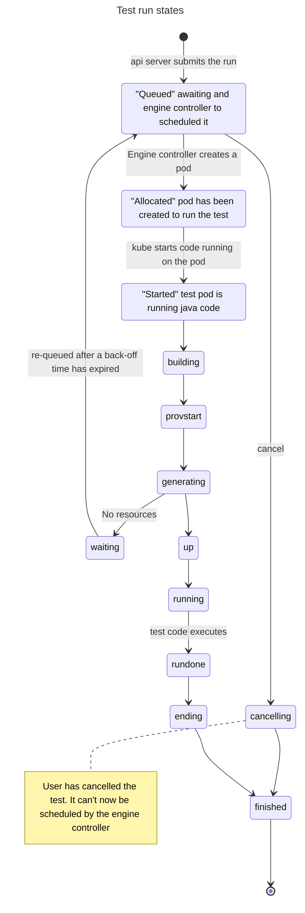

# Test run lifecycle

When a test runs, it passes through many states which may be apparent to anyone querying the test run as it gets ready to execute, executes, and cleans up.

If a manager used by the test fails to acquire the required resources, it enters the `waiting` state, and stays there for a while, then gets re-queued.

