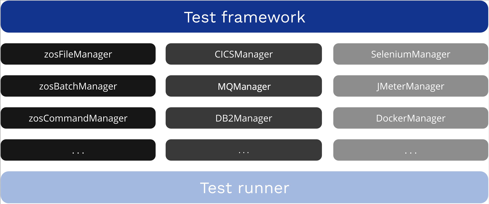

## Quick start

New to Galasa? Follow these steps to get started:

1. [Install the Galasa CLI](./cli-command-reference/installing-cli-tool.md) - Download and set up the command-line tool
2. [Initialize your local environment](./cli-command-reference/initialising-home-folder.md) - Create the necessary folder structure
3. [Create your first project](./cli-command-reference/setting-up-galasa-project.md) - Set up a test project
4. [Run a test locally](./cli-command-reference/runs-submit-local.md) - Execute your first test

For more detailed guidance, see the complete [Getting started guide](./cli-command-reference/index.md).

## Key concepts

Before diving into Galasa, familiarize yourself with these important terms:

- **OBR (OSGi Bundle Repository)**: An index of test bundles that tells Galasa where tests are located
- **CPS (Configuration Property Store)**: Stores configuration settings that control how tests run
- **DSS (Dynamic Status Store)**: Tracks resources currently in use during test execution
- **Manager**: A component that provides an interface to interact with a given tool or technology and can handle resource provisioning on behalf of tests

# Galasa architecture

Galasa has three major components that work together to execute your tests:

- **The core Galasa framework** - Orchestrates all activities
- **A collection of Managers** - Provide interfaces to tools and technologies
- **A test runner** - Executes your test code

/// caption
Galasa architecture showing the framework, Managers, and test runner components
///

## The core framework

The Galasa framework orchestrates all component activities and coordinates with the test runner to execute your tests. You write test code as a set of test classes and methods, but you do not need to write code to invoke your tests.

The framework automatically recognizes your test definitions and launches the required Managers and test runner to provision and execute them. This happens without you needing to explicitly invoke them.

**Key responsibilities:**

- Discovering and loading test classes
- Managing the test lifecycle
- Coordinating Manager activities
- Handling resource allocation and cleanup
- Reporting test results

You are unlikely to need to change the framework or test runner code during normal testing activities.

For more information about the benefits of using a framework for automated testing, see [Benefits of Galasa](../about/automation.md).

## Managers

Managers are the building blocks of Galasa tests. They provide the functionality you need to interact with systems and tools.

### Why use Managers?

Managers serve two main purposes:

1. **Reduce boilerplate code**: Managers handle repetitive setup and teardown tasks, so you can focus on writing test logic
2. **Provide proven tool interaction code**: Managers offer reliable, tested code for interacting with systems and tools

This makes test code simpler to write, understand, and maintain. You can focus on validating application changes rather than managing environmental resources.

### Manager characteristics

**Manager scope:** Some Managers provide general-purpose services, while others are more focused:

- `HTTPClientManager` provides a wide range of HTTP client facilities for testing web services
- `Db2Manager` focuses specifically on Db2 database interactions

**Manager collaboration:** Different Managers can work together to perform tasks, sharing information and delegating work to each other. The Galasa framework coordinates this collaboration automatically.

### Types of Managers

Galasa delivers three types of Managers:

#### Core Managers

Central, fundamental Managers with wide-ranging use. These handle common operations across different platforms.

**Examples:**

- `zosFileManager` - z/OS file operations (create, read, write, delete files)
- `zosBatchManager` - z/OS batch job management (submit jobs, check status)
- `zosCommandManager` - z/OS command execution (run system commands)

**Use case:** Use Core Managers when you need to perform basic operations on z/OS systems, such as setting up test data files or running batch jobs.

These are part of the core Galasa distribution.

#### Product Managers

Managers for interacting with specific products and applications.

**Examples:**

- `CICSTSManager` - CICS Transaction Server interactions (transactions, resources)
- `Db2Manager` - Db2 database operations (queries, updates, schema management)

**Use case:** Use Product Managers when testing applications that run on specific platforms like CICS or use specific databases like Db2.

Some product Managers are part of the core Galasa distribution.

#### Ancillary Managers

Managers that integrate useful software tools and components into your tests.

**Examples:**

- `SeleniumManager` - Web browser automation for UI testing
- `JMeterManager` - Performance testing and load generation
- `DockerManager` - Container management for test environments

**Use case:** Use Ancillary Managers when you need to incorporate external tools into your test workflow, such as testing web interfaces or running performance tests.

Once you master the basics, you might want to write your own Managers to expose the services of similar tools and components widely used within your team.

### Application-specific Managers

You may need to write a Manager specific to your application under test. This allows you to abstract application-specific boilerplate functionality into a single place, separate from the tests themselves.

**When to create an application-specific Manager:**

- Your tests repeatedly perform the same application-specific setup
- You have complex application interactions that would clutter test code
- You want to share application interaction code across multiple test projects

A [summary table of available Managers](./managers/index.md) lists Managers that are currently available.

## The test runner

The test runner executes your tests under the direction of the core framework. It handles the actual test execution process, running your test methods and reporting results.

**Key responsibilities:**

- Loading test classes and methods
- Executing test methods in the correct order
- Capturing test results and artifacts
- Handling test failures and exceptions
- Generating test reports

The test runner works seamlessly with the framework and Managers to provide a complete test execution environment.

## Next steps

Ready to start testing? Head to the [Getting started guide](./cli-command-reference/index.md) to begin your Galasa journey.

For more background on why Galasa was created and the problems it solves, see [About Galasa](../about/index.md).
