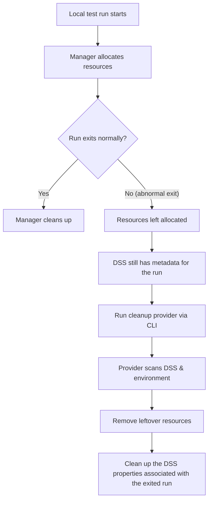

When local Galasa test runs exit unexpectedly, resources allocated by managers (e.g., files, datasets, containers, credentials, sockets) may remain active. Over time, these leftovers can exhaust shared capacity and disrupt other testers.  

This guide shows how to implement a cleanup provider (`IResourceManagementProvider`), package it in an OSGi bundle listed in an OBR, and execute it using the Galasa CLI command `galasactl runs cleanup local`.


## Who should use this
- Developers and testers running Galasa tests locally.
- Owners of manager implementations that allocate external or persistent resources.
- Teams maintaining shared environments who want consistent resource hygiene.


## Prerequisites
- Java development environment (JDK compatible with your Galasa build).
- Familiarity with OSGi bundles and building artifacts into an OBR (OSGi Bundle Repository).
- Access to the Galasa CLI (`galasactl`).
- The manager you’re cleaning up after (or its bundle) is available locally or in your repository.

> **Note:** Cleanup providers are often packaged in the **same bundle** as the manager that allocates the resources they clean up, but this is not required. A cleanup provider just needs to be in an OSGi bundle that can be loaded from an OBR.


## Key Concepts

- **IResourceManagementProvider:**  
  A Java interface provided by the Galasa framework that includes a `runOnce()` method. Your implementation should locate, validate, and remove leftover resources associated with incomplete runs.

- **OSGi Bundle & OBR:**  
  Your provider must be compiled into an OSGi bundle that is listed in an OBR so the Galasa framework can discover and load it.


## Overview: How Cleanup Works




## Step-by-Step Guide

### Step 1 — Implement `IResourceManagementProvider`

The Galasa framework provides an `IResourceManagementProvider` interface. Create a Java class that implements the `IResourceManagementProvider` interface's `runOnce()` method and performs your resource cleanup logic. The provider should:

- Identify resources associated with **incomplete** runs (e.g., status entries in DSS, resource IDs, temporary directories).
- Validate that cleanup is safe (e.g., confirm resource isn’t in active use).
- Perform idempotent operations (running twice should not cause errors).
- Log clearly what was found and what was cleaned.

**Minimal example:**

```java
package my.company.file.manager.resourcemanagement;

import org.apache.commons.logging.Log;
import org.apache.commons.logging.LogFactory;
// import galasa APIs and DSS helpers as needed

public class MyFileCleanupClass implements IResourceManagementProvider {
    private static final Log LOG = LoggerFactory.getLogger(MyFileCleanupClass.class);

    @Override
    public void runOnce() {
        LOG.info("Starting file cleanup for incomplete local runs");

        // Resource cleanup implementation goes here...

        LOG.info("File cleanup completed");
    }

    // other IResourceManagementProvider methods have been omitted from this snippet...
}
```

### Step 2 — Package into an OSGi Bundle and OBR

1. Add the class to your OSGi bundle (typically alongside the manager that allocates the resources).
2. Build an OBR project which includes the OSGi bundle that the `IResourceManagementProvider` class is in.
3. Publish the bundle and OBR to a local Maven repository or to a remote Maven repository.


### Step 3 — Run the Cleanup via the Galasa CLI
Use the Galasa CLI tool's `galasactl runs cleanup local` command to run your provider locally. For example:

```bash
galasactl runs cleanup local \
  --obr my.company.group/my.company.group.obr/0.0.1/obr \
  --includes-pattern "my.company.file.manager.resourcemanagement.MyFileCleanupClass" \
  --log -
```

where:

- `--obr` is given the coordinates to the OBR that lists the bundle containing your cleanup provider. Replace `my.company.group/my.company.group.obr/0.0.1/obr` with your actual OBR coordinates in the form `<group-id>/<artifact-id>/<version>/obr`.
- `--includes-pattern` can contain the fully-qualified class name(s) to include for execution. Supports pattern matching; specify multiple values if needed.
- `--log -` streams logs to standard output. Adjust as needed for your environment.

If you have more than one provider that you would like to execute from multiple OBRs:

```bash
galasactl runs cleanup local \
  --obr my.company/my.company.first.obr/0.0.1/obr \
  --obr my.company/my.company.second.obr/0.2.0/obr \
  --includes-pattern "my.company.*" \
  --log -
```

This pattern runs all classes with a prefix of `my.company.` in their fully-qualified names.

For more information about the `galasactl runs cleanup local` command's syntax and supported flags, refer to the [CLI reference](../reference/cli-syntax/galasactl_runs_cleanup_local.md).
