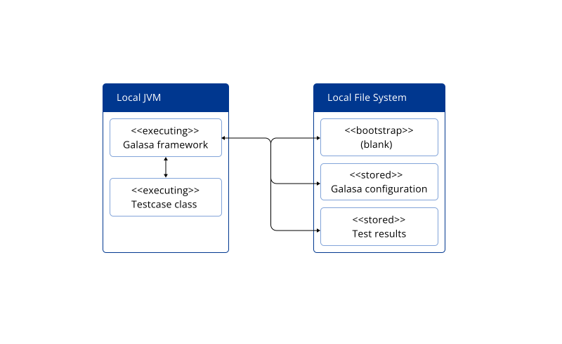
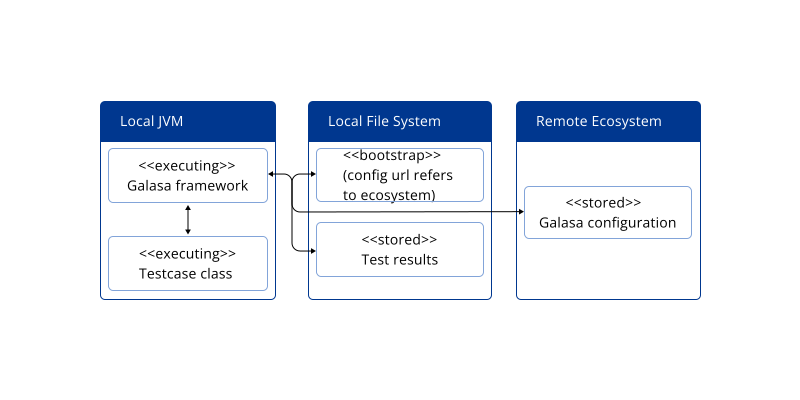
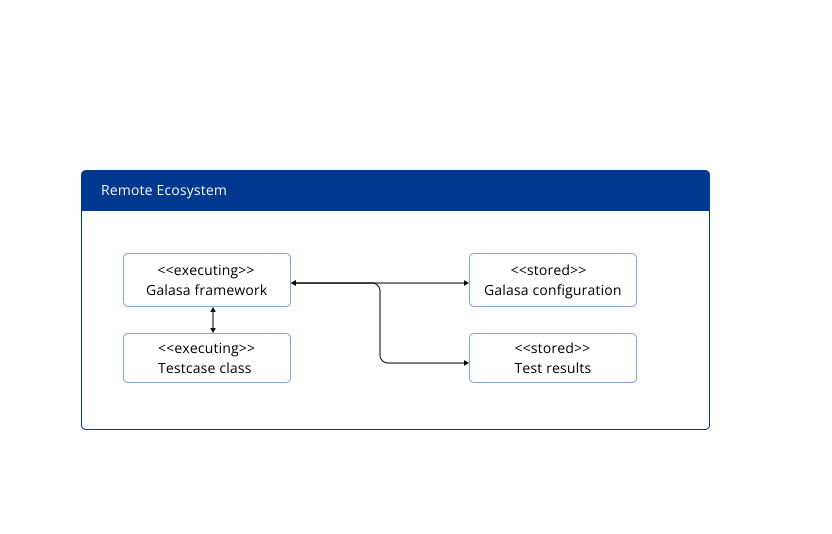

Galasa tests can run in three different modes, depending on your needs and environment setup.

## The three test modes

**1. Locally** - Everything runs on your local machine

**2. Locally with shared configuration** - Test runs locally but uses configuration from a Galasa Ecosystem

**3. Remotely** - Test runs in a Galasa Ecosystem

The mode you choose depends on what you are trying to achieve. Use this guide to understand which mode is best for your scenario.

!!! note "Authentication for Ecosystem access"

    If you are using modes 2 or 3 (interacting with a Galasa Ecosystem), you must authenticate using a personal access token.

    **Setup steps:**

    1. Request a personal access token from the Galasa Web UI
    2. Store the token in the `GALASA_TOKEN` property in your `galasactl.properties` file (located in your Galasa home folder), or alternatively set the `GALASA_TOKEN` environment variable

    For detailed instructions, see [Configuring authentication](../ecosystem/ecosystem-authentication.md).

## Mode 1: Running a test locally

**When to use:** During test development and ad-hoc testing against non-production environments.

**How it works:**

- Everything runs on your local machine
- The Galasa bootstrap file is blank (no Ecosystem reference)
- Configuration comes from local files
- Test runs in your local JVM
- Results and artifacts are stored on your local disk



**Command:** Use the [`galasactl runs submit local`](../reference/cli-syntax/galasactl_runs_submit_local.md) command.

!!! note "Running tests stored on a remote Maven repository"
    If your team publishes their tests to a remote Maven repository, you can run them in local mode by supplying the `--remoteMaven` option to the [`galasactl runs submit local`](../reference/cli-syntax/galasactl_runs_submit_local.md) command. This tells Galasa to download the test material from the given remote Maven repository if it is not already present in your local Maven repository.

    If your remote Maven repository requires authentication, you can supply a username and password to Galasa by setting the following properties in your `bootstrap.properties` file:

    ```properties
    maven.repository.username=yourusername
    maven.repository.password=yourpassword
    ```

    Alternatively, you can supply the username and password by setting the `GALASA_MAVEN_USERNAME` and `GALASA_MAVEN_PASSWORD` environment variables:

    === "Linux or macOS"
        ```bash
        export GALASA_MAVEN_USERNAME=yourusername
        export GALASA_MAVEN_PASSWORD=yourpassword
        ```

    === "Windows (PowerShell)"
        ```powershell
        set GALASA_MAVEN_USERNAME=yourusername
        set GALASA_MAVEN_PASSWORD=yourpassword
        ```

**Advantages:**

- Quick setup for development
- No network dependencies
- Full control over configuration

**Limitations:**

- Resources are not cleaned up if tests fail unexpectedly
- Test results are stored locally (harder to share)
- Cannot run many tests in parallel reliably

## Mode 2: Running locally with shared configuration

**When to use:** When you want to run tests locally but use configuration shared across your team.

**How it works:**

- Test runs in your local JVM
- Configuration is read from a remote Ecosystem
- Credentials still come from local files
- Results and artifacts are stored on your local disk



**Setup steps:**

1. Add these properties to your local `bootstrap.properties` file:

   ```properties
   framework.config.store=galasacps://my.ecosystem.url/api
   framework.extra.bundles=dev.galasa.cps.rest
   ```

   Where:
   - `https://my.ecosystem.url` is the URL of your Ecosystem Web UI
   - `framework.extra.bundles` loads the extension that handles `galasacps://` URLs

2. Set the `GALASA_TOKEN` environment variable to a valid token for your Ecosystem, or alternatively add it to your `galasactl.properties` file

3. Log in using: `galasactl auth login`

**Command:** Use the [`galasactl runs submit local`](../reference/cli-syntax/galasactl_runs_submit_local.md) command with your bootstrap configured.

**Advantages:**

- Share configuration across your team
- Run tests locally during development
- Consistent test behavior across different machines

## Mode 3: Running a test in the Galasa Ecosystem

**When to use:** For production testing, parallel test execution, and centralized result management.

**How it works:**

- Test runs in a container within the Ecosystem
- Configuration comes from the Ecosystem
- Results and artifacts are stored in the Ecosystem database
- Multiple users can view test results



**Setup steps:**

1. Configure authentication (see above)
2. Set your bootstrap file to the Ecosystem URL

**Command:** Use the [`galasactl runs submit`](../reference/cli-syntax/galasactl_runs_submit.md) command.

**Advantages:**

- **Parallel execution**: Run many tests simultaneously with proper resource management
- **Centralized results**: All test results stored in one place for easy access and reporting
- **Resource cleanup**: Managers automatically clean up resources even when tests fail
- **Scalability**: Handle large test suites efficiently
- **Collaboration**: Share test results with team members for debugging

## When to use each mode

### Use local mode when:

- Developing and debugging tests
- Running ad-hoc tests against development environments
- You have time to manually share test logs when issues occur
- Testing against systems with unlimited resources

### Use local mode with shared configuration when:

- You want consistent configuration across your team
- Developing tests that will eventually run in an Ecosystem
- You need to test against shared environments but want local execution

### Use Ecosystem mode when:

- Running tests in bulk or in parallel
- Multiple people or automation jobs need to run tests simultaneously
- Resources are limited and need management (ports, sessions, processing capacity)
- Test results need to be centrally stored and reported
- Automatic resource cleanup is important
- You need to integrate test results with other reporting systems
- Bug investigation requires sharing test artifacts with others

## Comparison table

| Feature | Local | Local + Shared Config | Ecosystem |
|---------|-------|----------------------|-----------|
| **Execution location** | Local JVM | Local JVM | Ecosystem pod |
| **Configuration source** | Local files | Ecosystem | Ecosystem |
| **Results storage** | Local disk | Local disk | Ecosystem RAS |
| **Resource cleanup** | Manual | Manual | Automatic |
| **Parallel execution** | Limited | Limited | Full support |
| **Result sharing** | Manual | Manual | Automatic |
| **Best for** | Development | Team development | Production testing |
